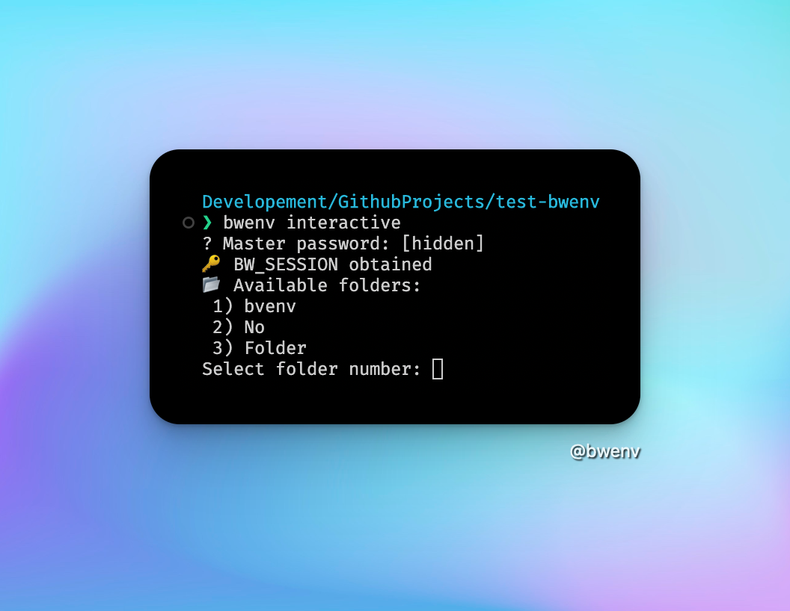
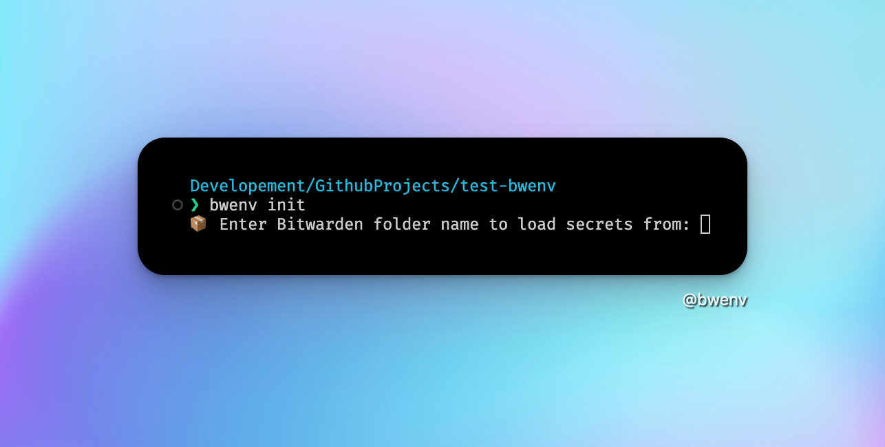

<div align="center">
  
  <h1>🔐 bwenv: Bitwarden + direnv Helper</h1>
  <p><em>Effortlessly sync secrets from Bitwarden folders into your shell environment with <b>direnv</b> magic!</em></p>
</div>

---

## 🚀 Overview

**bwenv** is a CLI tool that bridges your Bitwarden vault and your shell environment using [direnv](https://direnv.net/). It lets you securely load secrets from any Bitwarden folder directly into your `.envrc`, making secret management for development and deployment a breeze.

---

## ✨ Features

- **Interactive folder selection**: Pick Bitwarden folders interactively or by name
- **Automatic `.envrc` generation**: Instantly create a ready-to-use `.envrc` for direnv
- **Secure session management**: Handles Bitwarden session unlocking for you
- **Debug mode**: See exactly which secrets are loaded
- **Easy install/uninstall**: One command setup & cleanup

---

## 🛠️ Installation

```bash
make install
```

This will:

- Copy helper scripts to `~/.config/direnv/lib`
- Install the `bwenv` CLI to `~/.local/bin` (Unix/macOS) or `%USERPROFILE%\.local\bin` (Windows)
- Make everything executable

> **Note:** Requires [Bitwarden CLI](https://bitwarden.com/help/cli/) and [jq](https://stedolan.github.io/jq/) installed.

### Windows Setup

On Windows, make sure `%USERPROFILE%\.local\bin` is in your PATH environment variable:

```cmd
# Add to PATH (PowerShell as Administrator)
$env:PATH += ";$env:USERPROFILE\.local\bin"
[Environment]::SetEnvironmentVariable("PATH", $env:PATH, [EnvironmentVariableTarget]::User)
```

---

## ⚡ Usage

### 1. Initialize secrets for your project

```bash
bwenv init
```

- Prompts for Bitwarden folder name
- Unlocks your vault and generates `.envrc`
- Run `direnv allow` to activate secrets

### 2. Interactive folder selection

```bash
bwenv interactive
```

- Lists all Bitwarden folders
- Select by number for quick setup

### 3. Remove secrets

```bash
bwenv remove
```

- Deletes `.envrc` from your project

---

## 🧩 How It Works

- **Helper script**: Loads all fields from items in the selected Bitwarden folder as environment variables
- **Debug mode**: Set `DEBUG_BW=true` to see every loaded secret
- **Session**: Uses `BW_SESSION` for secure access

---

## 📦 Example Workflow

```bash
# Install
make install

# Initialize secrets
bwenv init
# or interactively
bwenv interactive

# Allow direnv to load secrets
direnv allow

# Remove secrets when done
bwenv remove
```

---

## 🖼️ Screenshots

| Interactive Selection Screenshot     | Init Screenshot             |
| ------------------------------------ | --------------------------- |
|  |  |

---

## 📝 License

MIT License. See [LICENSE](LICENSE) for details.

---

## 🤝 Contributing

Pull requests welcome! For major changes, open an issue first to discuss what you’d like to change.

---

<div align="center">
  <b>Made with ❤️ for easy development</b>
</div>
