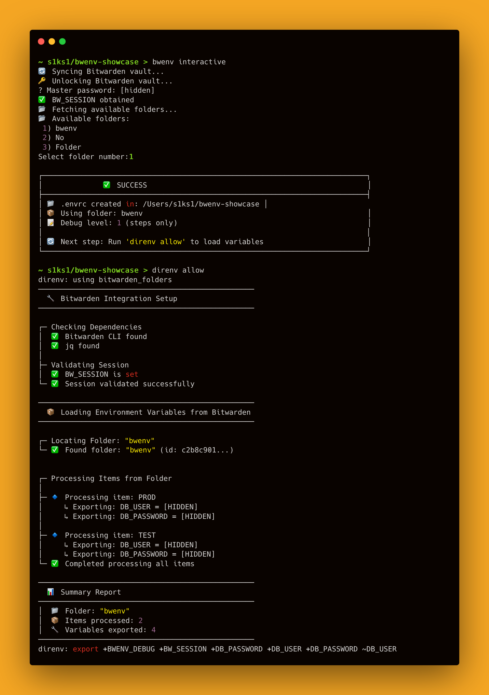
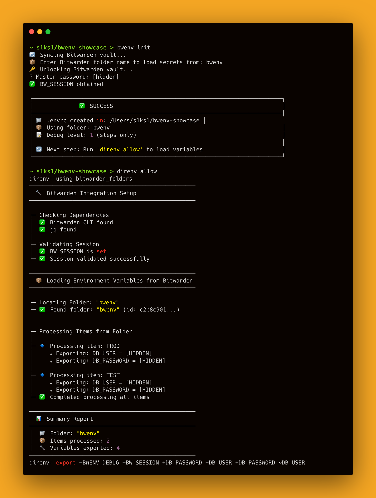

<div align="center">
  
  <h1>🔐 bwenv: Bitwarden + direnv Helper</h1>
  <p><em>Effortlessly sync secrets from Bitwarden folders into your shell environment with <b>direnv</b> magic!</em></p>
</div>

---

## 🚀 Overview

**bwenv** is a CLI tool that bridges your Bitwarden vault and your shell environment using [direnv](https://direnv.net/). It lets you securely load secrets from any Bitwarden folder directly into your `.envrc`, making secret management for development and deployment a breeze.

---

## ✨ Features

- **Interactive folder selection**: Pick Bitwarden folders interactively or by name
- **Automatic `.envrc` generation**: Instantly create a ready-to-use `.envrc` for direnv
- **Secure session management**: Handles Bitwarden session unlocking for you
- **Debug mode**: See exactly which secrets are loaded
- **Cross-platform**: Linux, macOS, and Windows support
- **Easy install/update/uninstall**: One command setup & cleanup via package managers or scripts

---

## 📦 Prerequisites

| Dependency | Description |
|---|---|
| [Bitwarden CLI](https://bitwarden.com/help/cli/) | Access your vault from the command line |
| [direnv](https://direnv.net/) | Automatically load/unload environment variables |
| [jq](https://stedolan.github.io/jq/) | JSON processor for parsing Bitwarden data |

---

## 🛠️ Installation

### One-Line Install

**Linux / macOS:**

```bash
curl -fsSL https://raw.githubusercontent.com/s1ks1/bwenv/main/install.sh | bash
```

**Windows (PowerShell):**

```powershell
irm https://raw.githubusercontent.com/s1ks1/bwenv/main/install.ps1 | iex
```

### Package Managers

**Homebrew (macOS / Linux):**

```bash
brew tap s1ks1/bwenv
brew install bwenv
```

**Scoop (Windows):**

```powershell
scoop bucket add bwenv https://github.com/s1ks1/scoop-bwenv
scoop install bwenv
```

### From Source (Linux / macOS)

```bash
git clone https://github.com/s1ks1/bwenv.git
cd bwenv
make install
make setup-path   # adds ~/.local/bin to PATH if needed
```

### Uninstall

```bash
# Linux / macOS (if installed via script or make)
curl -fsSL https://raw.githubusercontent.com/s1ks1/bwenv/main/uninstall.sh | bash
# or: make uninstall

# Windows (PowerShell)
irm https://raw.githubusercontent.com/s1ks1/bwenv/main/uninstall.ps1 | iex

# Homebrew
brew uninstall bwenv

# Scoop
scoop uninstall bwenv
```

---

## ⚡ Usage

### 1. Initialize secrets for your project

```bash
bwenv init                    # Default: show steps, hide secrets
bwenv --debug=2 init         # Full debug: show steps and secrets
bwenv --quiet init           # Quiet mode: minimal output
```

- Prompts for Bitwarden folder name
- Unlocks your vault and generates `.envrc`
- Run `direnv allow` to activate secrets

### 2. Interactive folder selection

```bash
bwenv interactive            # Default: show steps, hide secrets
bwenv --debug interactive    # Full debug: show steps and secrets
```

- Lists all Bitwarden folders
- Select by number for quick setup

### 3. Test installation

```bash
bwenv test
```

- Checks all dependencies and configuration
- Verifies direnv hook setup
- Tests Bitwarden session validity

### 4. Remove secrets

```bash
bwenv remove
```

- Deletes `.envrc` from your project

### Debug Options

| Flag | Level | Description |
|---|---|---|
| `--quiet`, `-q` | 0 | No debug output |
| *(default)* | 1 | Show steps, hide secrets |
| `--debug=2`, `--debug` | 2 | Show steps and secrets |

---

## 🧩 How It Works

1. **`bwenv init`** or **`bwenv interactive`** unlocks your Bitwarden vault and generates a `.envrc` file
2. The `.envrc` loads the **helper script** (`bitwarden_folders.sh`) via direnv's `use` mechanism
3. The helper reads all custom fields from items in the selected Bitwarden folder
4. Each field is exported as an environment variable in your shell

**Session**: Uses `BW_SESSION` for secure access to your vault — no secrets stored on disk.

---

## 📦 Example Workflow

```bash
# Install
curl -fsSL https://raw.githubusercontent.com/s1ks1/bwenv/main/install.sh | bash

# Verify
bwenv test

# Initialize secrets
bwenv init              # or: bwenv interactive

# Allow direnv to load secrets
direnv allow

# Verify secrets are loaded
echo $YOUR_SECRET_VAR

# Remove secrets when done
bwenv remove
```

---

## 🖼️ Screenshots

### Interactive Selection
<div align="center">
  
</div>

### Init Command
<div align="center">
  
</div>

---

## 📝 License

MIT License. See [LICENSE](LICENSE) for details.

---

## 🤝 Contributing

Pull requests welcome! For major changes, open an issue first to discuss what you'd like to change.

---

<div align="center">
  <b>Made with ❤️ for easy development</b>
</div>
