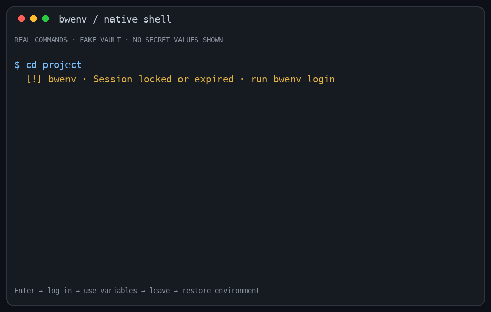
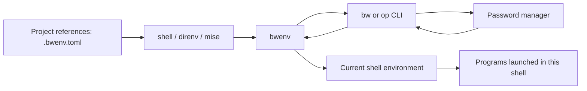

<div align="center">
  
  <h1>bwenv v3</h1>
  <p>Load project secrets from Bitwarden or 1Password into your shell.</p>
  <p>
    <a href="https://github.com/s1ks1/bwenv/actions/workflows/ci.yml"></a>
    <a href="LICENSE"></a>
  </p>
  <p><a href="INSTALL.md">Install</a> · <a href="docs/getting-started.md">Get started</a> · <a href="docs/commands.md">Commands</a> · <a href="docs/troubleshooting.md">Troubleshooting</a></p>
</div>

bwenv connects a password manager to a project directory. Choose a folder or vault,
select the items you need, and load their fields as environment variables. The
project stores references; decrypted values stay in the shell and provider processes.

> [!NOTE]
> This is the user guide for **bwenv 3.x**. Native `shell` activation is the default;
> `direnv` and `mise` are optional. Native and mise backends retain their experimental
> status in v3; see [supported shells and setup](docs/activation.md).
> Start with [installation](INSTALL.md), then set up your first project.

Upgrading from v2? Read the [migration guide](docs/migration.md). The previous
[v2.4.1 release](https://github.com/s1ks1/bwenv/releases/tag/v2.4.1) remains
available for download; possible v2 patches use the `v2` maintenance branch.

## Start here

| Your goal | Read |
| --- | --- |
| Install bwenv and the required tools | [Installation](INSTALL.md) |
| Set up your first project, with a safe test secret | [Getting started](docs/getting-started.md) |
| Choose a hook once and configure your shell | [Shell, direnv and mise](docs/activation.md) |
| Change preferences, item selection or project metadata | [Configuration](docs/configuration.md) |
| Look up commands, flags and aliases | [Command reference](docs/commands.md) |
| Use bwenv in scripts or CI | [Automation](docs/automation.md) |
| Fix login, missing variables or noisy hooks | [Troubleshooting](docs/troubleshooting.md) |
| Upgrade an older project | [Migration](docs/migration.md) |
| Understand security boundaries | [Security model](docs/security.md) |
| Contribute or review release readiness | [Contributing](CONTRIBUTING.md) · [Release checks](docs/release-readiness.md) |

## Quick start

You need `bwenv`, one password manager CLI (`bw` or `op`), and Bash, Zsh or Fish.
For Bitwarden, first run `bw login`. For 1Password, configure the CLI's desktop
integration or an existing valid CLI session. Create a test folder/vault with an
item field named `BWENV_DEMO` and the non-sensitive value `hello-bwenv`.

```sh
mkdir -p ~/bwenv-demo
cd ~/bwenv-demo
bwenv init
```

Follow the picker, then **open a new terminal** or source the RC file shown by
setup. Return to the project:

```sh
cd ~/bwenv-demo
bwenv login
bwenv doctor
```

Check the test field without displaying its value (Bash/Zsh):

```sh
if [ "${BWENV_DEMO:-}" = hello-bwenv ]; then
  printf '%s\n' 'Demo variable loaded'
fi
```

The installed shell wrapper makes `bwenv login` update your current terminal;
you do not need to type `eval` each time. When you leave a native-hook project,
bwenv restores variables to their previous values. A new shell or an expired
Bitwarden session needs login again. See the [complete walkthrough](docs/getting-started.md)
for Fish, provider setup, picker controls and verification.

### See the workflow



This animation uses the real bwenv binary with a deterministic **fake Bitwarden
CLI**, not a real vault. It shows the native hook and masks values by checking
presence only. [Accessible transcript and reproduction](docs/demo.md).

## Choose your hook once

Run `bwenv config`, select **Default Activation Hook**, press Enter to cycle
through options, then **S** to save. Existing projects keep their own mode.

| Hook | Best fit | Additional dependency | Project artifact |
| --- | --- | --- | --- |
| `shell` (default, experimental) | Bash/Zsh/Fish users wanting minimal setup | None | `.bwenv.toml` |
| `direnv` | Users already relying on direnv's directory trust | `direnv` | `.bwenv.toml` + `.envrc` |
| `mise` (experimental) | Users already managing tools with mise | `mise` | `.bwenv.toml` + `.bwenv.mise.sh` + a block in `mise.toml` |

Override the default for one project with `bwenv init --activation direnv` or
`bwenv init --activation mise`. [One-time hook setup](docs/activation.md) includes
all shell commands and the trust steps.

## Everyday commands

| Action | Command |
| --- | --- |
| Authenticate and load this project's variables | `bwenv login` |
| Explicitly sync provider data and reload | `bwenv refresh` |
| Diagnose setup without showing secret values | `bwenv doctor` |
| Inspect project, provider and preferences | `bwenv status` |
| Disable automatic loading for this project | `bwenv disallow` |
| Re-enable and load the project | `bwenv allow` |
| Lock/sign out providers and clear this shell | `bwenv lock` |
| Remove bwenv project configuration | `bwenv remove` |

Automatic activation never asks for a password. If authentication is required,
the hook gives a short login hint. Mise's automatic loads are silent; they do not
print an export summary after every unrelated command.

## How it works


```mermaid
flowchart LR
    Project["Project references: .bwenv.toml"] --> Hook["shell / direnv / mise"]
    Hook --> Bwenv["bwenv"]
    Bwenv --> CLI["bw or op CLI"]
    CLI --> Vault["Password manager"]
    Vault --> CLI
    CLI --> Bwenv
    Bwenv --> Env["Current shell environment"]
    Env --> App["Programs launched in this shell"]
```

Bitwarden supplies custom fields; 1Password supplies labeled item fields except
notes, OTP and empty values. [Field naming and selection rules](docs/getting-started.md#1-prepare-your-secret-fields)
explain how to avoid collisions.

> [!CAUTION]
> Programs launched from your terminal, including AI coding tools, can inherit
> its secrets. bwenv keeps decrypted exports out of generated project files; it
> does not isolate them from those programs. Locking clears the invoking shell,
> not other terminals or already-running processes.

## For contributors

```sh
make build
make test
make lint
```

Source builds require Go 1.25 or newer. See [CONTRIBUTING.md](CONTRIBUTING.md),
[architecture](docs/architecture.md), [provider development](docs/providers.md)
and [performance](docs/performance.md). The optional agent and shared memory
cache are future work; they are not required or included in this workflow.

Licensed under [MIT](LICENSE). Report bugs through [GitHub issues](https://github.com/s1ks1/bwenv/issues);
report vulnerabilities through [SECURITY.md](SECURITY.md).
